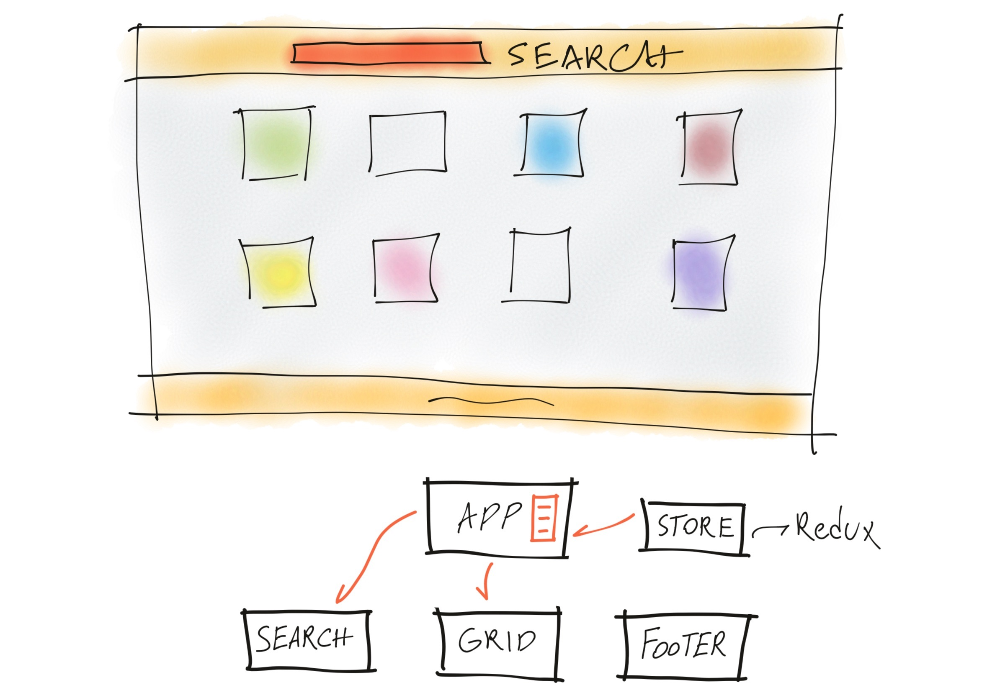

## `Grocery app`

An online marketplace for the user to search from range of grocery items.

## `Wireframe`



## `Launch`

To install back-end dependencies:

```
$ npm install
```

To install front-end dependencies:

```
$ npm run client-install
```

To concurrently run both servers:

```
$ npm run dev
```

## `Flow`

Initial state of the app will render four items fetched from back-end. Simply search for below items to experience the flow:

- Egg
- Honey
- Bread
- Strawberry
- any letter, 'a'

Search bar is not case sensitive. As long as the input matches any items's name it will be displayed on the screen.

## `TDD`

Unit tests are provided for React components.
To run unit tests `cd` to the `client` directory:

```
$ npm run test
```

## `Technologies & Libraries`

- React
- Express
- Redux
- Jest
- Enzyme
- CSS